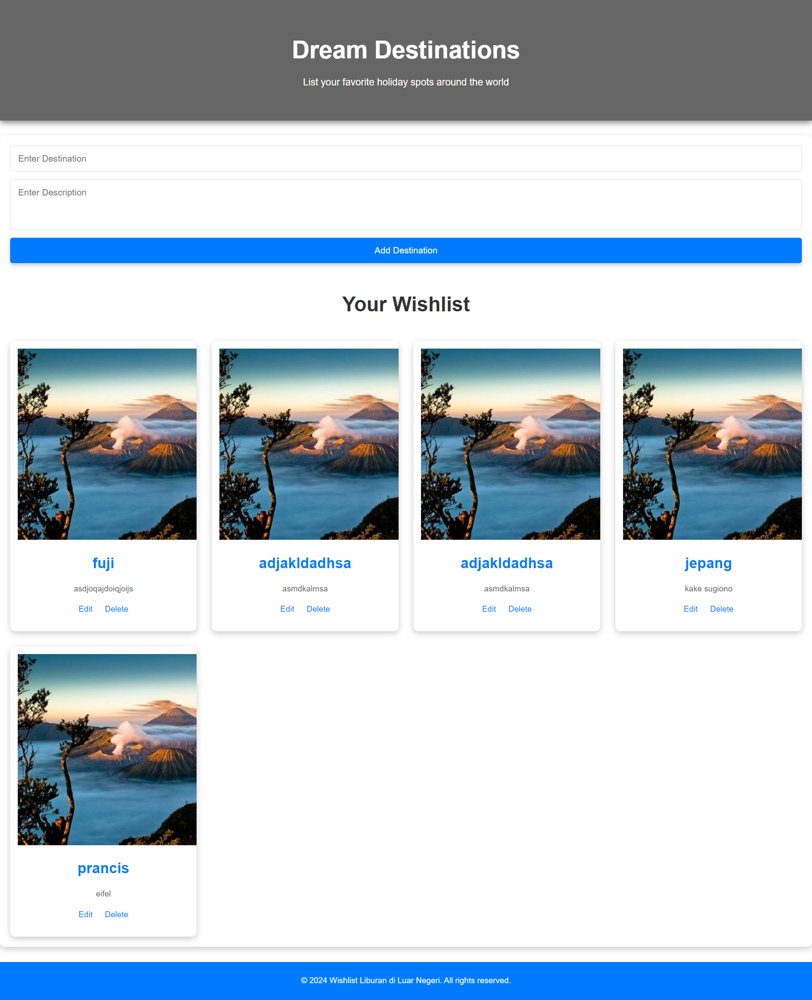

## Simple Web Wishlist Destinatiom ##
1.  ### Description : 
- Wishlist Liburan di Luar Negeri adalah aplikasi web sederhana yang dirancang untuk membantu pengguna merencanakan dan mengelola daftar impian liburan mereka ke luar negeri. Proyek ini menggunakan HTML, CSS, PHP, dan SQLite sebagai basis datanya. Dengan antarmuka yang ramah pengguna, aplikasi ini memungkinkan pengguna untuk menambahkan, melihat, mengedit, dan menghapus tujuan liburan yang mereka inginkan.



2. ### Fitur Utama:

- Menambahkan Tujuan Liburan: Pengguna dapat dengan mudah menambahkan tujuan liburan baru ke dalam daftar mereka dengan mengisi formulir yang sederhana.

- Melihat Daftar Tujuan: Aplikasi ini menampilkan daftar semua tujuan liburan yang telah ditambahkan oleh pengguna, lengkap dengan detail dan tanggal rencana kunjungan.

- Mengedit Tujuan Liburan: Pengguna memiliki opsi untuk mengedit detail tujuan liburan yang sudah ada, memungkinkan mereka untuk memperbarui rencana sesuai kebutuhan.

- Menghapus Tujuan Liburan: Pengguna dapat menghapus tujuan liburan dari daftar mereka jika mereka sudah tidak tertarik atau ingin menggantinya dengan yang baru.

- Desain Responsif: Aplikasi ini dirancang dengan responsif, sehingga dapat diakses dengan baik melalui berbagai perangkat, termasuk smartphone dan tablet.

- Antarmuka yang Sederhana dan Menarik: Dengan desain yang bersih dan minimalis, pengguna dapat dengan mudah menavigasi aplikasi dan menikmati pengalaman penggunaan yang menyenangkan.

3. ### Teknologi yang Digunakan:

- HTML: Untuk struktur halaman web.
- CSS: Untuk styling dan tata letak halaman.
- PHP: Untuk menangani logika sisi server dan interaksi dengan basis data.
- SQLite: Sebagai sistem basis data yang ringan dan efisien untuk menyimpan informasi tentang tujuan liburan.

4. ### Cara Memulai:

- Clone Repositori: Gunakan perintah berikut untuk meng-clone repositori ini ke mesin lokal Anda.

- ```git clone https://github.com/username/repo-name.git ```

- Instalasi: Pastikan Anda memiliki server lokal yang dapat menjalankan PHP dan SQLite, seperti XAMPP atau MAMP.

- Konfigurasi Database: Import file database SQLite jika diperlukan (jika disediakan dalam repositori).

- Jalankan Aplikasi: Akses aplikasi melalui browser dengan mengunjungi URL lokal yang sesuai.


#### trimakasi yaa hehe babaii 